# evidence/

Coloca aquí (todas tomadas desde la **consola web de AWS** y Postman):

- `01_user_pool.png` — resumen de **tu** User Pool con el **User Pool ID**.
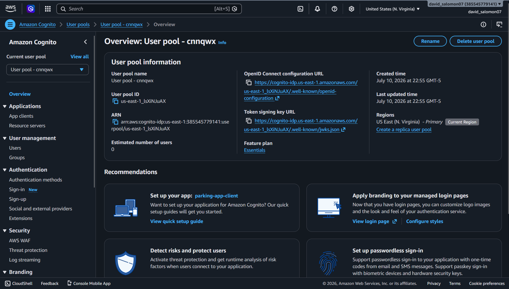
- `02_groups.png` — pestaña **Groups** con `ADMIN` y `USER`.
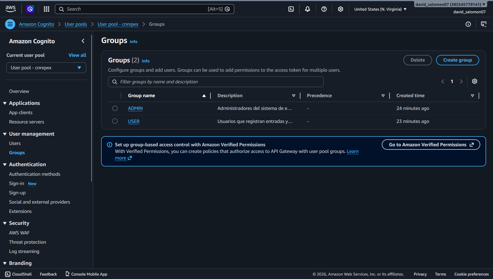
- `03_membership_admin.png` — usuario `admin_parking` mostrando su grupo `ADMIN`.

- `04_membership_user.png` — usuario `user_parking` mostrando su grupo `USER`.
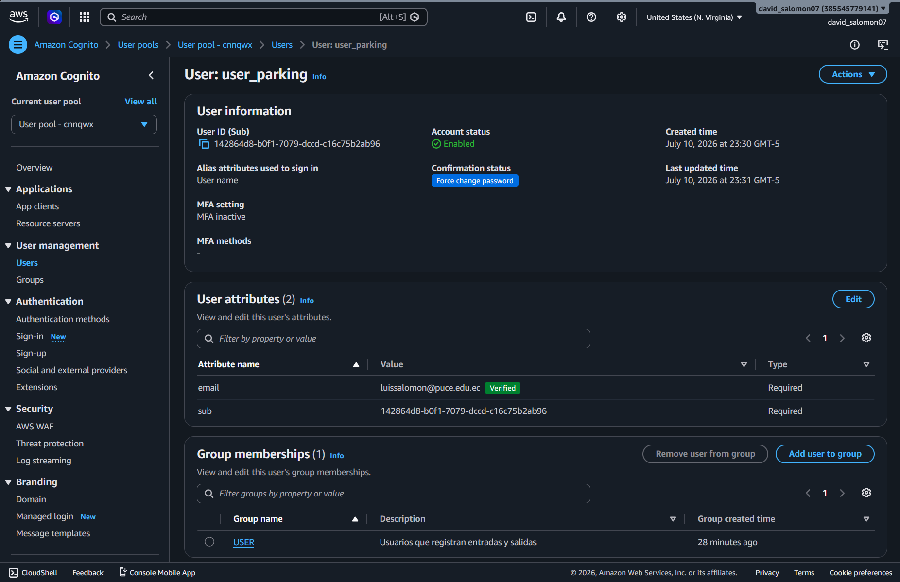
- `05_app_client_domain.png` — App client + dominio **por defecto** de Cognito.
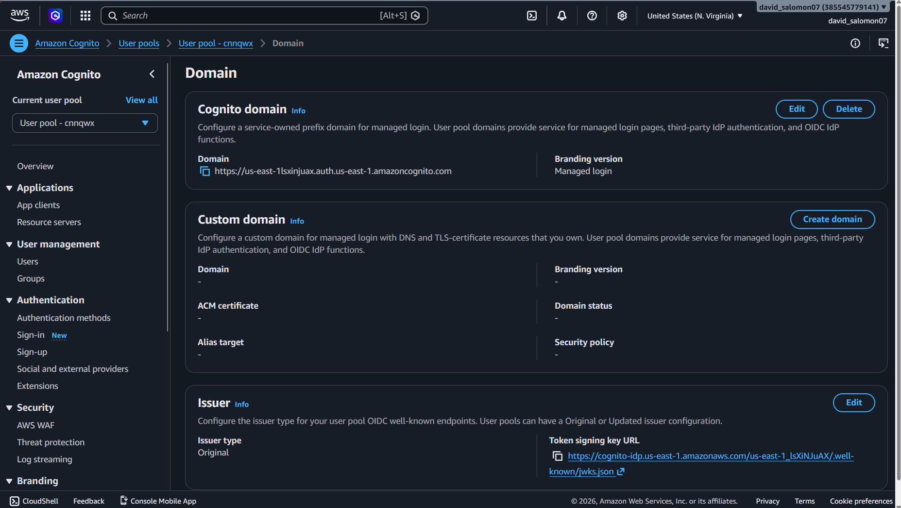
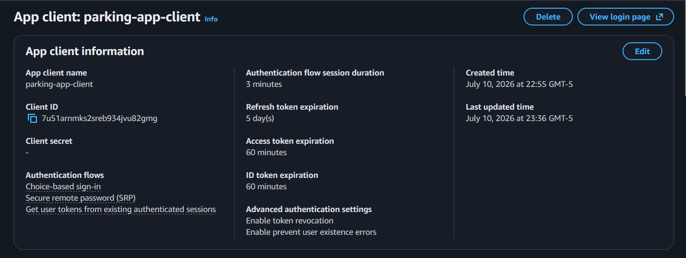
- `06_jwt_admin.png` / `07_jwt_user.png` — jwt.io con el claim `cognito:groups`.
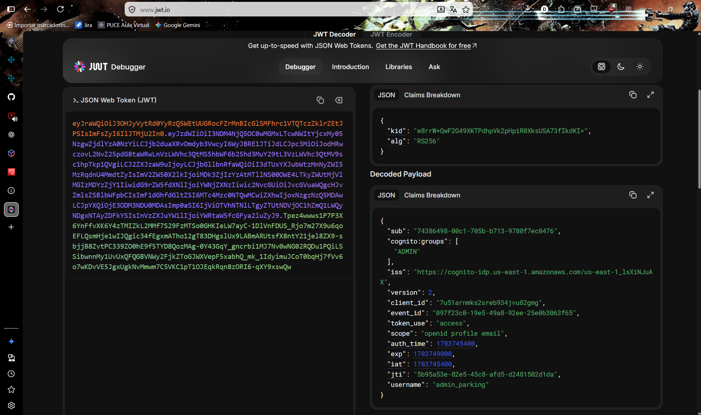
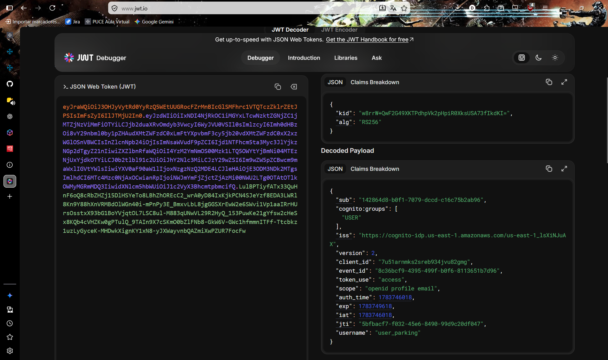
- `08_postman_available_200.png` — `GET /parking-spaces/available` sin token.
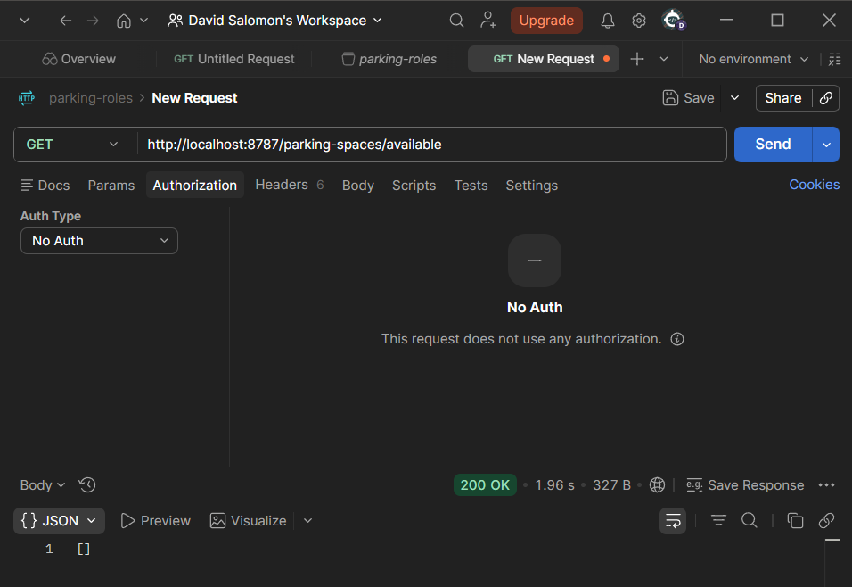
- `09_postman_create_401_403_201.png` — `POST /parking-spaces` sin token / USER / ADMIN.
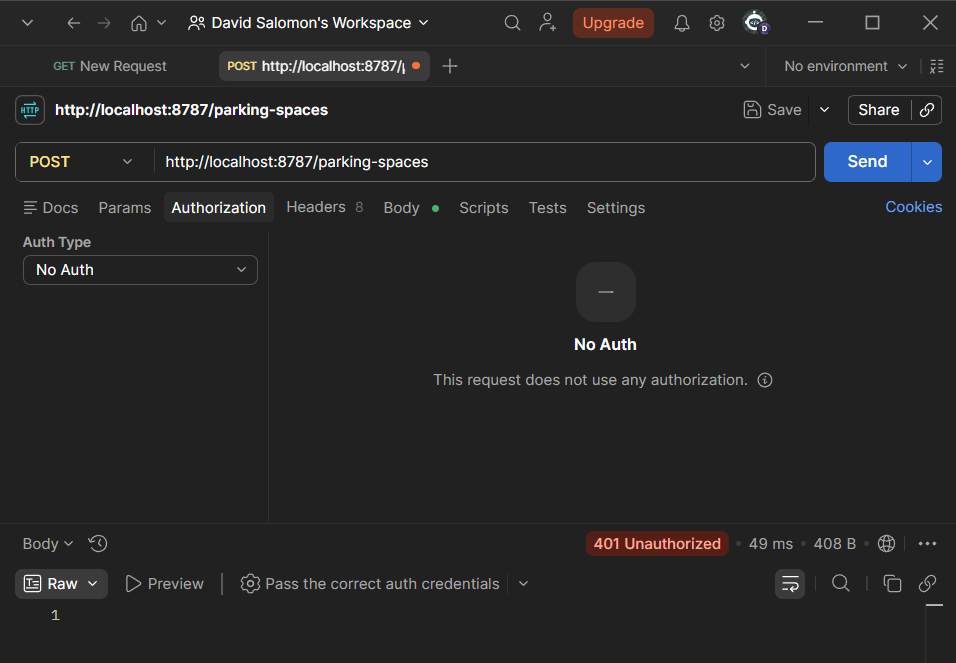
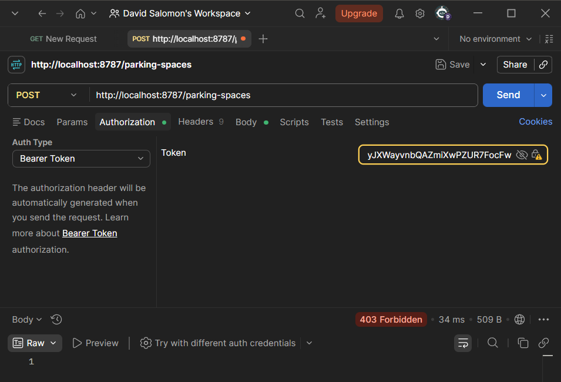
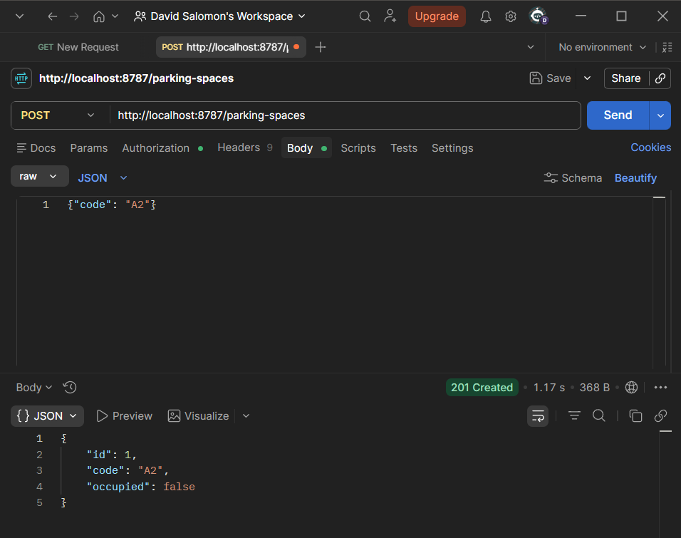
- `10_postman_entry_403_201.png` — `POST /tickets/entry` con ADMIN / USER.
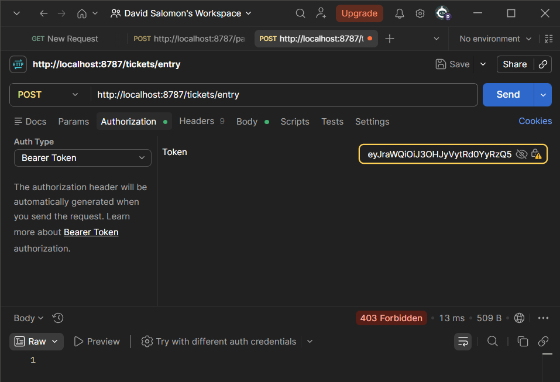
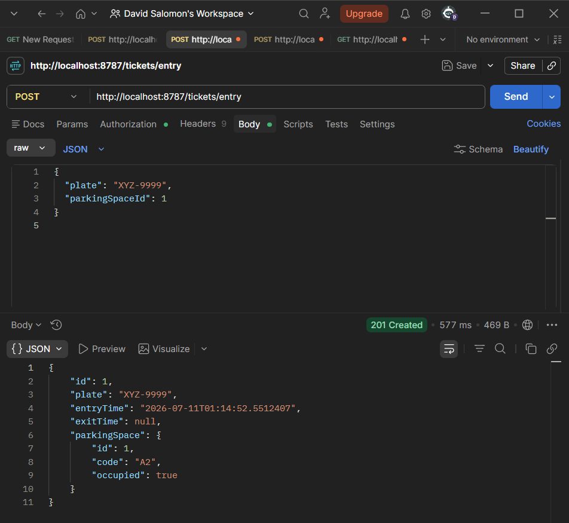
- `coverage.png` — Run with Coverage del `TicketService` al 100%.
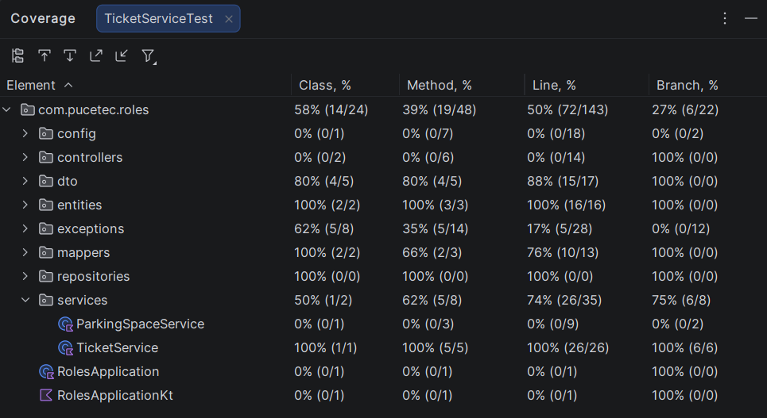
- `parking-roles.postman_collection.json` — colección exportada.
